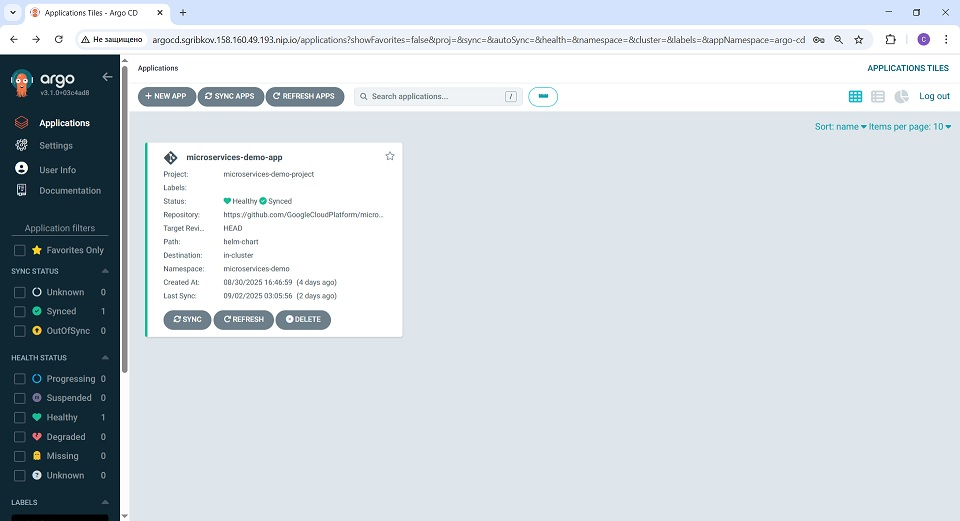
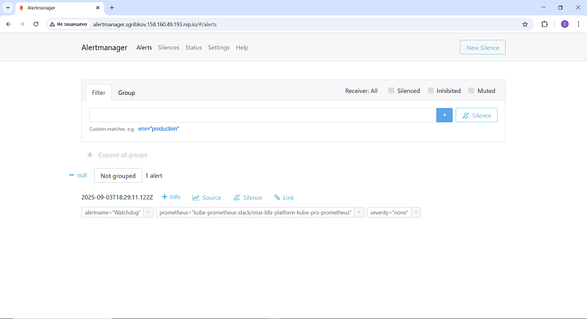

# Инфраструктурная платформа для приложений   на базе managed Kubernetes Yandex Cloud

Инфраструктура платформы включает:
- Мониторинг кластера и приложения с алертами и дашбордами с использованием kube prometheus stack, который включает:
  - Prometheus Operator
  - Prometheus
  - Alert Manager
  - Grafana
  - kube-state-metrics
  - Prometheus Node Exporter
- Централизованное логирование для кластера и приложений с использовнием Loki и Promtail
- CI/CD пайплайн для приложений с использованием gitops инструмента Argo CD

CI/CD данного репозитория позволяет развернуть платформу со всеми компонентами, а также демонстрационное приложение - [Online Boutique by Google](https://github.com/GoogleCloudPlatform/microservices-demo).
Для развертывания платформы используются утилиты Terraform и CLI Yandex Cloud.

UI компонентов и приложения доступны по URL, имеющим следующую структуру:

*http://<имя компонента>.<домен 4 уровня>.<.yandex vpc address>.nip.io*

Все доступные URL выводятся Git Actions после развертывания. Доступны UI следующих компонентов:
- Argo CD
- Prometheus
- Alert Manager
- Grafana
- демонстрационное приложение Online Boutique by Google

## Развертывание платформы
### Подготовительные работы
1. Зарегистрироваться в Yandex Cloud, создать платежный аккаунт, убедиться, что он находится в статусе ACTIVE или TRIAL_ACTIVE (при наличии пропустить шаг)
2. Создать каталог для плалформы
3. Создать service account в созданном ранее каталоге со следующими правами:
- container-registry.images.puller
- iam.serviceAccounts.accessKeyAdmin
- k8s.cluster-api.cluster-admin
- k8s.clusters.agent
- k8s.admin
- load-balancer.admin
- logging.viewer
- logging.writer
- storage.editor
- vpc.publicAdmin
- vpc.securityGroups.admin
4. Скопировать данный репозиторий локально и связать его с удаленным репозиторием GitHub

### Развертывание
1. Создать ключ доступа для service account

*yc iam key create \
   --service-account-id <..id service account..> \
   --folder-name <..id каталога..> \
   --output key.json*

2. В репозитории GitHub создать следующие переменные и секреты для GitHub Actions:
- CLOUD_ID: id облака, секрет
- FOLDER_ID: id каталога, секрет
- SERVICE_ACCOUNT_ID: id service account, секрет
- SERVICE_ACCOUNT_KEY: ключ доступа - содержимое файла key.json (см. предыдущий пункт) в формате json string, секрет
- FOUR_LEVEL_DOMAIN: домен 4 уровня для адресов компонентов инфраструктуры и приложений, переменная

3. Запустить job GitHub Actions для развертывания кластера Kubernetes с инфраструктурой и приложением путем push в ветку master
4. Скопировать URL из вывода шагов job GitHub Actions:
   - URL компонентов инфраструктуры - из шага Deploy infrastructure with Terraform
   - URL приложения - из шага Deploy workload applications with Terraform
5. Открыть в браузере URL компонентов инфраструктуры и приложения, при необходимости ввести логины и пароли.

### Демонстрационный экемпляр платформы
Развернут демонстрационный экемпляр платформы, доступны UI компонентов платформы и приложения по следующим URL:
- Argo CD: http://argocd.sgribkov.158.160.49.193.nip.io
- Prometheus: http://prometheus.sgribkov.158.160.49.193.nip.io
- Alert Manager: http://alertmanager.sgribkov.158.160.49.193.nip.io
- Grafana: http://grafana.sgribkov.158.160.49.193.nip.io
- Online Boutique by Google: http://microservices-demo.sgribkov.158.160.49.193.nip.io

Логины и пароли предоставляются отдельно.

#### Argo CD

#### Prometheus

#### Alert Manager

#### Дашборды в Grafana

#### Логи в Grafana

#### Online Boutique by Google

